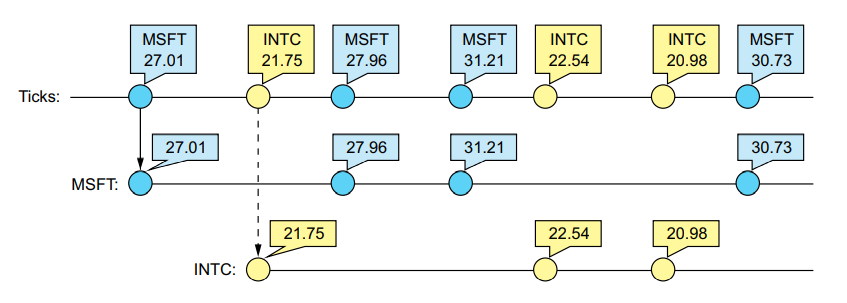
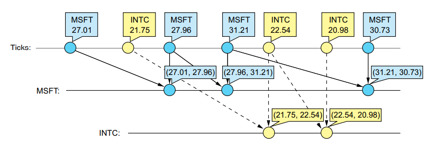
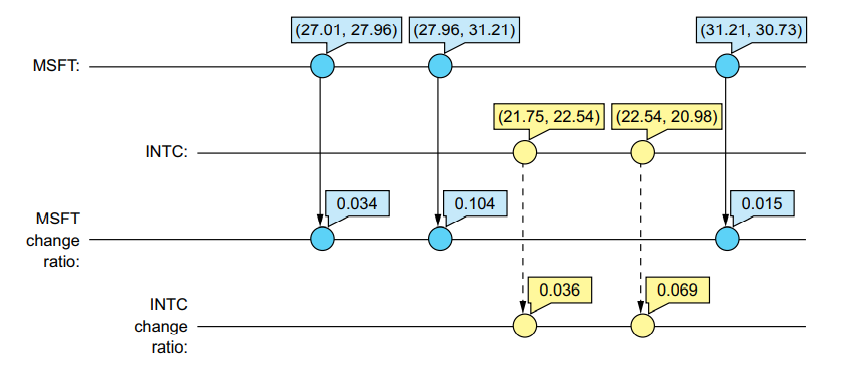
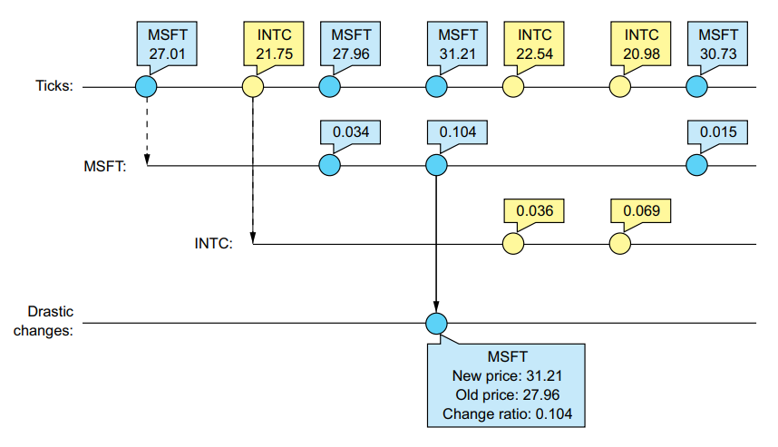

## 前言

在上一章里，我们学习了响应式的基本概念。在这一章节，我们将编写一个**股票监控**程序。首先我们将使用传统的 .NET 事件系统来写一次，之后再通过 Rx 来重构。

## 传统事件写法

1. 先编写一个类，其中只有一个事件属性：

```c#
class StockTicker
{
    public event EventHandler<StockTick> StockTick; 
}
```

2. 编写一个类包含我们的数据：

```c#
class StockTick
{
    public string QuoteSymbol { get; set; }
    public decimal Price { get; set; }
}
```

3. 创建一个类来监听变化，并订阅事件：

```c#
class StockMonitor
{ 
    public StockMonitor(StockTicker ticker)
    {
        ticker.StockTick += OnStockTick; // OnStockTick 注册事件
    }
    ...
}
```

4. 因为我们需要比较股票价格的变化，所以我们可以通过字典来存储先前的股票数据。编写一个新类：

```c#
class StockInfo
{
    public StockInfo(string symbol, decimal price)
    {
        Symbol = symbol;
        PrevPrice = price;
    }
    public string Symbol { get; set; }
    public decimal PrevPrice { get; set; }
}
```

之后你可以在 `StockMonitor` 中声明一个 `StockInfo` 类型的属性。

5. 每当股票变化时，`OnStockTick`  就会被调用。因此，我们的应用还要实现一个新旧数据比较的功能。我们将使用 `TryGetValue` 方法。当我们想要的值存在时，这个方法会返回一个 `true`。在 `StockMonitor` 中编写以下代码：

```c#
var _stockInfos = new Dictionary<string, StockInfo>();

void OnStockTick(object sender, StockTick stockTick)
{
    StockInfo stockInfo;
    var quoteSymbol = stockTick.QuoteSymbol;
    var stockInfoExists = _stockInfos.TryGetValue(quoteSymbol, out stockInfo);
    ...
}
```

6. 如果一个股票数据存在，我们就可以比较大小了：

```c#
const decimal maxChangeRatio = 0.1m;
...
var quoteSymbol = stockTick.QuoteSymbol;
var stockInfoExists = _stockInfos.TryGetValue(quoteSymbol, out stockInfo);

if (stockInfoExists)
{
    var priceDiff = stockTick.Price-stockInfo.PrevPrice; 

    // 变化的百分比
    var changeRatio = Math.Abs(priceDiff/stockInfo.PrevPrice); 

    if (changeRatio > maxChangeRatio)
    {
        // 简单打印个信息，用的是 C# 6.0 以前的写法
        Console.WriteLine("Stock:{0} has changed with {1} ratio, Old Price:{2} New Price:{3}", quoteSymbol, changeRatio, stockInfo.PrevPrice, stockTick.Price);

    }

    //保存这个新数据
     _stockInfos[quoteSymbol].PrevPrice = stockTick.Price; 
}
```

7. 那如果我们不想要订阅股票消息了咋办？幸运的是 .NET 提供了方法来干这个活。在 `StockMonitor` 里编写以下方法：

```c#
public void Dispose()
{
    _ticker.StockTick -= OnStockTick; 
    _stockInfos.Clear();
}
```

8. 写一点假数据，测试一下结果：

```
// 瞎编的
Symbol: "MSFT" Price: 100
Symbol: "INTC" Price: 150
Symbol: "MSFT" Price: 170
Symbol: "MSFT" Price: 195

// 运行结果
Stock:MSFT has changed with 0.7 ratio, Old Price:100 New Price:170
Stock:MSFT has changed with 0.15 ratio, Old Price:170 New Price:195.5
```

哇哦，感觉还不错嘛！

但是这么写就一点问题没有吗？

### 并发问题

我们的程序运行起来没啥问题，但背后有个严重漏洞：

不是**并发**的！

如果 `StockMonitor` 运行期间又有新的股票变化咋办？

很抱歉，只能等着第一次程序结束。

### 线程不安全

虽然我们的 `StockInfo` 字典支持多读者（Multiple Readers）同时读取，但当我们读取字典时字典正在被修改，那么就会报错。

这是你可能会说，可以改用 .NET 提供的无锁 `ConcurrentDictionary` 呀！这样就不报错了。

但是，那我们每次比较的**新值**又是谁？是修改前的，还是修改后的？

你可能又会说，可以使用线程锁（Thread Lock）来阻塞两个同时发生的线程的其中一个。

可是如果资源不及时释放，又很容易导致**死锁**问题。

## 响应式写法

使用 Rx 的话，传统事件写法暴露出的问题可以通过更简单的方式解决。

### 安装 Rx.NET

你都看到这里了，相信咋安装根本不用我教你。

Rx.NET 放在 `System.Reactive` 名称空间下。

### 事件转换

Rx.NET 提供了好用的 `FromEventPattern` 方法，帮助我们将事件转换成可观察对象（Observable）：

```c#
IObservable<EventPattern<StockTick>> ticks =
        Observable.FromEventPattern<EventHandler<StockTick>, StockTick>( 
            h => ticker.StockTick += h, 
            h => ticker.StockTick -= h);
```

谔谔，看不懂捏...

那来看一下这个方法的定义吧：

```c#
FromEventPattern<TDelegate,TEventArgs(Action<TDelegate>addHandler, Action<TDelegate> removeHandler)
```

- `TDelegate` 是匹配事件的委托 → `EventHandler<StockTick>`
- `TEventArgs` 就是 `EventArgs`  →  `StockTick`
- `addHandler` 和 `removeHandler` 一般就直接写成 Lambda 表达式的形式

因为我们只关心传入的 `EventArgs`，所以代码可以改写成：

```c#
var ticks = Observable.FromEventPattern<EventHandler<StockTick>, StockTick>(
            h => ticker.StockTick += h, 
            h => ticker.StockTick -= h) 
        .Select(tickEvent => tickEvent.EventArgs);
```

### 数据处理

现在你已经有了一个可观察的数据流了，我们将围绕它展开查询操作，就像 LINQ 一样。

#### 分组 Group

我们试着通过 `Symbol` 来为每支股票分组：

```c#
// 查询语句形式
from tick in ticks 
group tick by tick.QuoteSymbol into company

// 函数形式
ticks.GroupBy(tick => tick.QuoteSymbol);
```



#### 分批 Buffer

`Buffer` 用于同组内再分批（Batch）。

在这里是同组内数据两两前后比较：




```c#
from tick in ticks
group tick by tick.QuoteSymbol into company
from tickPair in company.Buffer(2, 1)
let changeRatio = Math.Abs((tickPair[1].Price - tickPair[0].Price) / 
    tickPair[0].Price)
```



最后全部的代码：

```c#
const decimal maxChangeRatio = 0.1 m;

var drasticChanges = 
    from tick in ticks
    group tick by tick.QuoteSymbol
    into company
    from tickPair in company.Buffer(2, 1)
    let changeRatio = Math.Abs((tickPair[1].Price - tickPair[0].Price) / tickPair[0].Price)
    where changeRatio > maxChangeRatio
    select new DrasticChange()
    {
    Symbol = company.Key,
        ChangeRatio = changeRatio,
        OldPrice = tickPair[0].Price,
        NewPrice = tickPair[1].Price
    };
```



### 消费数据

```c#
_subscription = 
    drasticChanges.Subscribe(change => {
        Console.WriteLine($"Stock:{change.Symbol} has changed with {change.ChangeRatio} ratio, 
        Old Price: {change.OldPrice} 
        New Price: {change.NewPrice}");
    },
    ex => { /* 处理错误 */}, 
    () => {/* 响应任务完成 */});
```

### 取消订阅

```c#
public void Dispose()
{
    _subscription.Dispose();
}
```

### 同步流

还记得我们之前使用事件系统的问题吗？

异步 IO 会导致线程不安全。

因此我们要将我们的 `ticks` 可观察数据流转换成同步的：

```c#
var ticks = Observable.FromEventPattern<EventHandler<StockTick>, StockTick>(
            h => ticker.StockTick += h, 
            h => ticker.StockTick -= h) 
        .Select(tickEvent => tickEvent.EventArgs)
        .Synchronize();
```

### 总览代码

```c#
class RxStockMonitor : IDisposable
{
    private IDisposable _subscription;
    public RxStockMonitor(StockTicker ticker)
    {
        const decimal maxChangeRatio = 0.1m;
        var ticks = 
            Observable.FromEventPattern<EventHandler<StockTick>, StockTick>(
                    h => ticker.StockTick += h, 
                    h => ticker.StockTick -= h) 
                .Select(tickEvent => tickEvent.EventArgs)
                .Synchronize(); 
        var drasticChanges = 
            from tick in ticks 
            group tick by tick.QuoteSymbol 
            into company 
            from tickPair in company.Buffer(2, 1) 
            let changeRatio = Math.Abs((tickPair[1].Price -
                                        tickPair[0].Price)/tickPair[0].Price) 
            where changeRatio > maxChangeRatio 
            select new 
            { 
                Symbol = company.Key, 
                ChangeRatio = changeRatio, 
                OldPrice = tickPair[0].Price, 
                NewPrice = tickPair[1].Price 
            }; 
        _subscription = 
            drasticChanges.Subscribe(change => 
                { 
                    WriteLine($"Stock:{change.Symbol} has changed
                        with {change.ChangeRatio} ratio,
                    Old Price: {change.OldPrice} 
                    New Price: {change.NewPrice}"); 
                }, 
                ex => { /* 处理错误 */}, 
                () =>{/* 响应任务完成 */});
    }

    public void Dispose() 
    {
        _subscription.Dispose();
    }
}
```

## Rx 的优点

我们已经用两种方式编写了这个股票监控程序，是时候比较两种写法了。

- 代码更紧凑：所有逻辑集中在一起

- 更少的资源占用：Rx 几乎没有资源处理的开销

- 强大的操作符：Rx 最明显的优势

- 更简单地同步：一个 `Synchronize` 方法足矣
