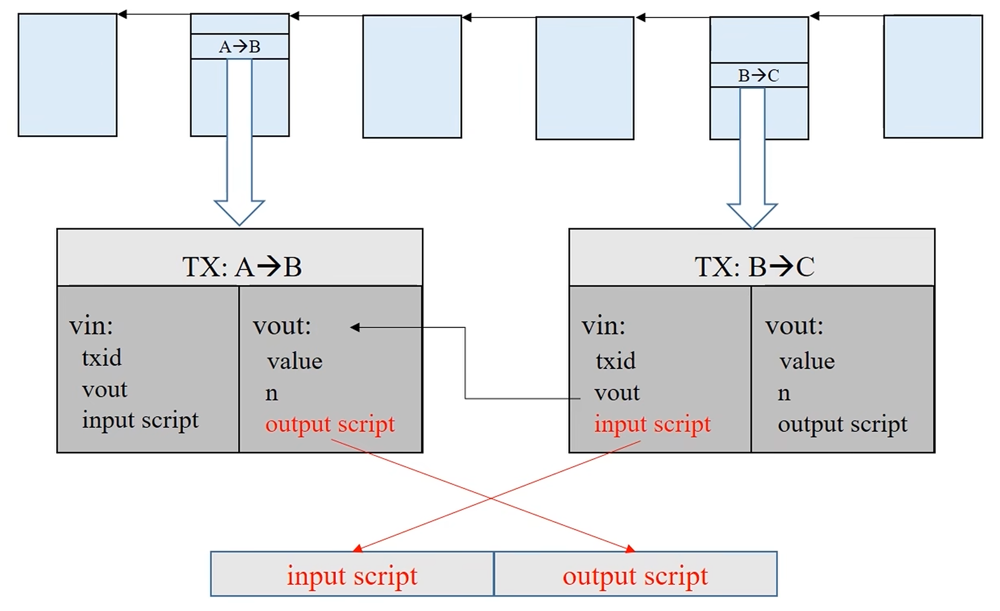

> 不要被学术思维或是程序员思维限制创造力。

# 密码学基础

哈希函数的三个特点：

1. 单向性（One-Wayness）：$X \rightarrow H(X)$。
2. 唯一性（Uniqueness）：$X$ 只对应一个 $H(X)$。
3. 抗碰撞性（Collision Resistance）：不存在 $H(X) = H(Y)$。

# 数据结构

最重要的**哈希树**（Merkle Tree）结构。


# 区块链实现

**UTXO**（Unspent Transaction Output）：所有没被花掉的交易的输出。全节点要在内存中维护 UTXO，以便快速检验是否存在 Double Spending。

# 网络

1. 比特币网络使用 P2P 和 TCP，便于穿透防火墙。
2. 比特币对区块有 1M 字节的限制。

# 挖矿难度

1. 挖矿原理：$$ Hash(Block \ Header) \leq Target $$

2. 比特币采用 SHA-256 算法，也就是说目标值有 $2^{256}$ 个取值。

3. 挖矿难度：$$ Difficulty = \frac{Difficulty^{=1} \ Target}{Target} $$ 

4. 限制出块时间。出块时间太短：容易改链。

5. 比特币规定每隔 2016 个区块要调整阈值。目标阈值迭代更新方法：

$$ Target=Target \times \frac{Actual \ Time}{Expected \ Time} $$  

$$ Expected \ Time = 2016 \times 10 \ min/block $$ 

6. 挖矿难度用 nBits 格式存储，包含在区块头中。

7. 比特币系统中的参数可能只在中本聪的一念之间。 

# 挖矿

| 轻节点                                                           | 全节点                                             |
| ---------------------------------------------------------------- | -------------------------------------------------- |
| 不一定在线                                                       | 一直在线                                           |
| 不用保存整个区块链，只要保存每个区块的区块头                     | 在本地硬盘上维护完整的区块链信息                   |
| 不用保存全部交易，只保存与自己相关的交易                         | 在内存里维护 UTXO 集合，以极快速度验证交易的正确性 |
| 无法验证大多数交易的合法性，只能验证与自己相关的那些交易的合法性 | 监听比特币网络上的交易信息，验证每个交易的合法性   |
| 无法检测网上发布的区块的正确性                                   | 决定哪些交易会打包到区块里                         |
| 可以验证好的难度                                                 | 监听别的矿工挖出来的区块，验证其合法性             |
| 只能检测哪个是最长链，不知道哪个是最长合法链                     | 挖矿（选择链分支）                                 |

**ASIC**（Application Specific Integrated Circuit）：专门为挖矿而生的芯片。现在的挖矿难度用 GPU 已经划不来了。有的加密货币还提出 Alternative Puzzle 来抵抗 ASIC 挖矿。

**矿池**：矿主分配任务，矿工提交 Almost Vaild Block 给矿主来计算工作量。

# 比特币脚本

**Bitcoin Scripting Language**：非常简单，基于栈的语言。



## 交易结构
```json
"result": {
    "txid": "921a...dd24",
    "hash": "921a...dd24",
    "version": 1,
    "size": 226,
    "locktime": 0,
    "vin": [...],
    "vout": [...],
    "blockhash":    "0000000000000000002c510d...5c0b",
    "confirmations": 23,
    "time": 1530846727,
    "blocktime": 1530846727
}
```
### 交易的输入
```json
"vin": [
    {
    "txid": "c0cb...c57b",
    "vout": 0, // 对应上一个交易的第 0 个输出
    "scriptSig": {
            "asm": "3045...0018",
            "hex": "4830...0018"
        }
    }
]
```

### 交易的输出
```json
"vout": [
  {
    "value": 0.22684000, // 交易金额，也可以用 Satoshi 作为单位
    "n": 0,
    "scriptPubKey": {
      "asm": "DUP HASH160 628e...d743 EQUALVERIFY CHECKSIG",
      "hex": "76a9...88ac",
      "reqSigs": 1,
      "type": "pubkeyhash",
      "addresses": [
        "19z8LJkNXLrTv2QK5jgTncJCGUEEfpQvSr"
      ]
    }
  },
  {
    "value": 0.53756644,
    "n": 1,
    "scriptPubKey": {
      "asm": "DUP HASH160 da7d...2cd2 EQUALVERIFY CHECKSIG",
      "hex": "76a9...88ac",
      "reqSigs": 1,
      "type": "pubkeyhash",
      "addresses": [
        "1LvGTpdyeVLcLCDK2m9f7Pbh7zwhs7NYhX"
      ]
    }
  }
]
```
## P2PK

**Pay to Puclic Key**，最简单。

- **Input Script**:
  - PUSHDATA(SIG)
- **Output Script**:
  - PUSHDATA(PubKey)
  - CHECKSIG

## P2PKH

**Pay to Public Key Hash**，最常用。

- **Input Script**:
  - PUSHDATA (Sig)
  - PUSHDATA (PubKey)

- **Output Script**:
  - DUP：将 PubKey 再复制一份
  - HASH160
  - PUSHDATA (PubKeyHash)
  - EQUALVERIFY
  - CHECKSIG

## P2SH

**Pay to Script Hash**，可以实现多重签名。

- **Input Script**:
  - ×
  - PUSHDATA (Sig_1)
  - PUSHDATA (Sig_2)
  - ...
  - PUSHDATA (Sig_M)
  - PUSHDATA (serialized *RedeemScript*)

- **Output Script**:
  - HASH160
  - PUSHDATA (*RedeemScript*Hash)
  - EQUAL

- **redeemScript**:
  - M
  - PUSHDATA (pubkey_1)
  - PUSHDATA (pubkey_2)
  - ...
  - PUSHDATA (pubkey_N)
  - N
  - CHECKMULTISIG
  
# 分叉

## 状态分叉

因为对区块状态意见不合导致的分叉，例如*分叉攻击*。

## 协议分叉

- 硬分叉：需要所有区块都升级。
- 软分叉：不需要所有区块都升级的更新，例如 P2SH。

# 匿名性

**零知识证明**：零知识证明允许一方（证明者）向另一方（验证者）证明某个陈述的真实性，而无需透露任何与该陈述相关的具体信息。

零币和零钞的概念。

# 思考

## 哈希指针

Block Header 中实际上没有指针，只有哈希值。全节点将 (key, value) 存储在 LevelDB 中，key 就是哈希值。

## 区块恋

对于多个人共享账户，不要用截断私钥的方法。应该用多重签名（MULTISIG）。

## 比特币的稀缺性

比特币发行量固定，但稀缺的东西不适合做货币。优秀的货币要自带通胀的功能。要不然就有人作壁上观，越来越富。

## 量子计算

量子计算距离实用还很远。而且量子计算的出现其实对传统金融业的影响更大，因为所有传输都会变得不安全。