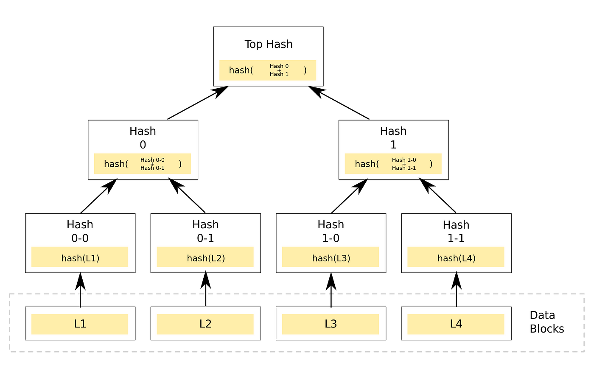

# 密码学基础

哈希函数的三个特点：

1. 单向性（One-Wayness）
2. 唯一性（Uniqueness）：$X$ 只对应一个 $H(X)$。
3. 抗碰撞性（Collision Resistance）：不存在 $H(X) = H(Y)$。

# 数据结构

最重要的**哈希树**（Merkle Tree）结构。

# 区块链实现

**UTXO**（Unspent Transaction Output）：所有没被花掉的交易的输出。全节点要在内存中维护 UTXO，以便快速检验是否存在 Double Spending。

# 网络

1. 比特币网络使用 P2P 和 TCP，便于穿透防火墙。
2. 比特币对区块有 1M 字节的限制。

# 挖矿难度

1. 挖矿原理：\[ Hash(block \ header) \leq target\]

2. 比特币采用 SHA-256，也就是有 $2^{256}$ 个取值。

3. 挖矿难度：\[ difficulty = \frac{difficulty \_1\_ target}{target} \]

4. 限制出块时间。出块时间太短：容易改链。

5. 每隔 2016 个区块要调整阈值。目标阈值迭代更新方法：

\[target=target \times \frac{actual \ time}{expected \ time}\] 

\[expected \ time = 2016 \times 10 \ min/block\]
